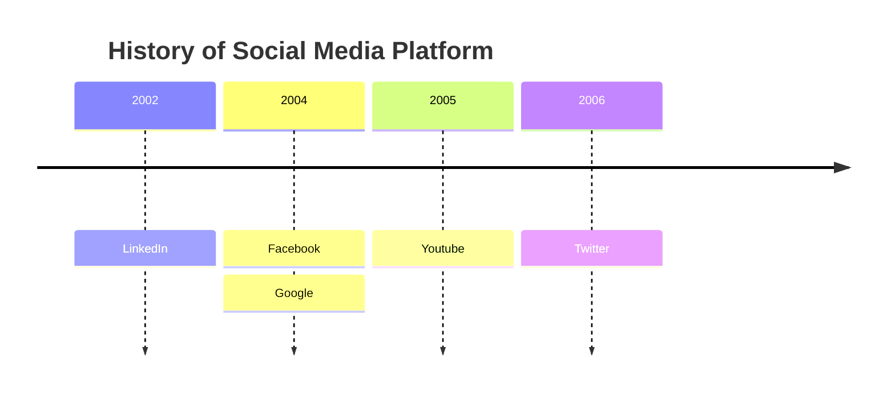

<mark style="background: #D2B3FFA6;">*Q What are children in React?  
**A:** Children are props that represent the nested elements passed between a component’s opening and closing tags.</mark>

 now let me tell you something when ever you are trying to make cahnge in state make sure to add the previous state value inside it!!!!   

![[Pasted image 20260105005207.png]]